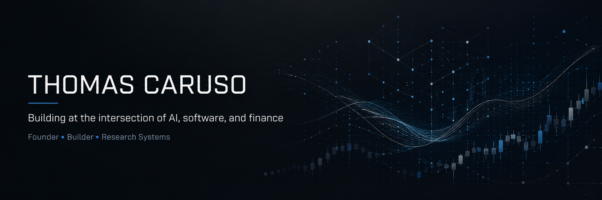

  

I build products and research systems at the intersection of **AI, software, and finance**. I study Finance at Fairfield University while shipping consumer products, research infrastructure, and AI-driven backend systems.

## Selected work

### [OpenAlpha](https://github.com/ThomasCaruso/OpenAlpha) — Financial ML research
Preregistered research infrastructure for independently evaluating Kronos, a pretrained financial foundation model.

**3 completed studies** · **1,600 generations** · **sealed preregistrations** · **immutable artifacts** · **reproducible offline**

The project ultimately falsified its own founding structural-repair hypothesis and published the negative result. The central finding: structural validity and forecasting skill were separable properties, and repairing invalid financial outputs did not improve forecast accuracy.

### Rot Royale — Consumer mobile product
Built and shipped an iOS product around short-form cognitive challenges, taking it from product strategy and game mechanics through backend systems, mobile distribution, analytics, and growth experimentation.

`React` · `Next.js` · `FastAPI` · `PostgreSQL` · `Capacitor`

### Nova — AI sales infrastructure
Building an event-driven outreach system for prospect identity, outbound and inbound evidence, deterministic message classification, policy-controlled lead transitions, and auditable automation.

The core constraint is simple: **every automated decision should be traceable to the evidence that caused it.**

## Current focus

`AI systems` · `Applied ML` · `Research infrastructure` · `Consumer software` · `Backend systems` · `Financial markets`

## Tools

`Python` · `TypeScript` · `React` · `FastAPI` · `PostgreSQL` · `PyTorch`

---

*I care about systems that survive contact with real data: test assumptions, preserve negative results, separate evidence from interpretation, and change direction when the evidence says the original idea was wrong.*

**Contact:** thomas@webhorizondigital.com
